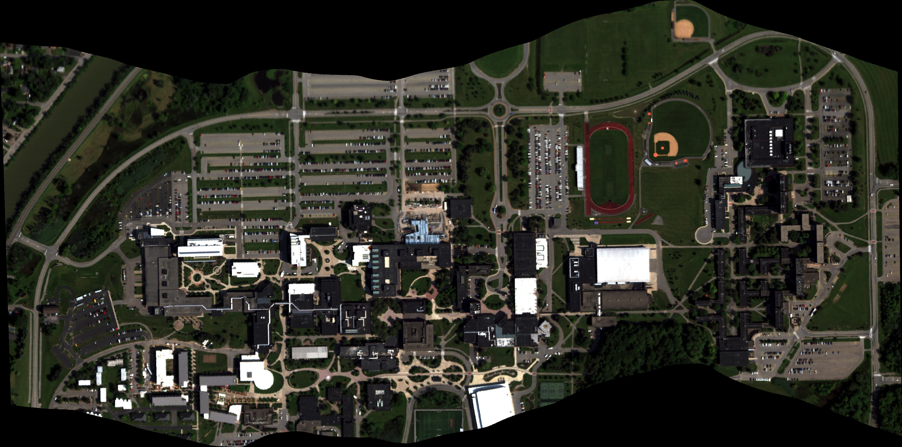

# AeroCampus
A New Hyperspectral Scene for Semantic Segmentation

## Scene information

Scene information coming soon. 

The scene images can be found [here](https://drive.google.com/drive/folders/1_eenUjORT25wOqAMvgp0x0v21vGZQUSH?usp=sharing). The Google directory contains four files: 
1. image_rgb - The RGB rectified hyperspectral scene.
2. image_hsi_radiance - Radiance calibrated hyperspectral scene sampled at every 10th band (400nm, 410nm, 420nm, .. 900nm).
3. image_hsi_reflectance - Reflectance calibrated hyperspectral scene sampled at every 10th band (400nm, 410nm, 420nm, .. 900nm).
4. image_labels - Semantic labels for the entire AeroCampus scene.

## Codebase
Basic code API coming soon.

## License

This scene dataset is made freely available to academic and non-academic entities for non-commercial purposes such as academic research, teaching, scientific publications, or personal experimentation. Permission is granted to use the data given that you agree:
1. That the dataset comes “AS IS”, without express or implied warranty. Although every effort has been made to ensure accuracy, we (Rochester Institute of Technology) do not accept any responsibility for errors or omissions.
2. That you include a reference to the AeroCampus Dataset in any work that makes use of the dataset.
3. That you do not distribute this dataset or modified versions. It is permissible to distribute derivative works in as far as they are abstract representations of this dataset (such as models trained on it or additional annotations that do not directly include any of our data) and do not allow to recover the dataset or something similar in character.
4. You may not use the dataset or any derivative work for commercial purposes such as, for example, licensing or selling the data, or using the data with a purpose to procure a commercial gain.
5. That all rights not expressly granted to you are reserved by us (Rochester Institute of Technology).

## Acknowledgement

When using the dataset, please cite (citation coming soon).

